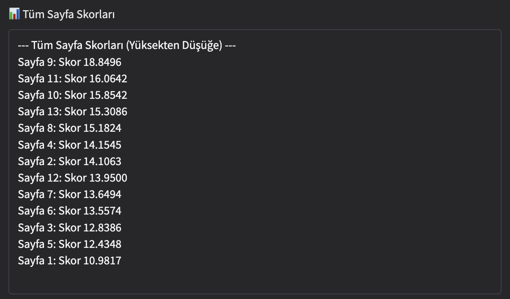
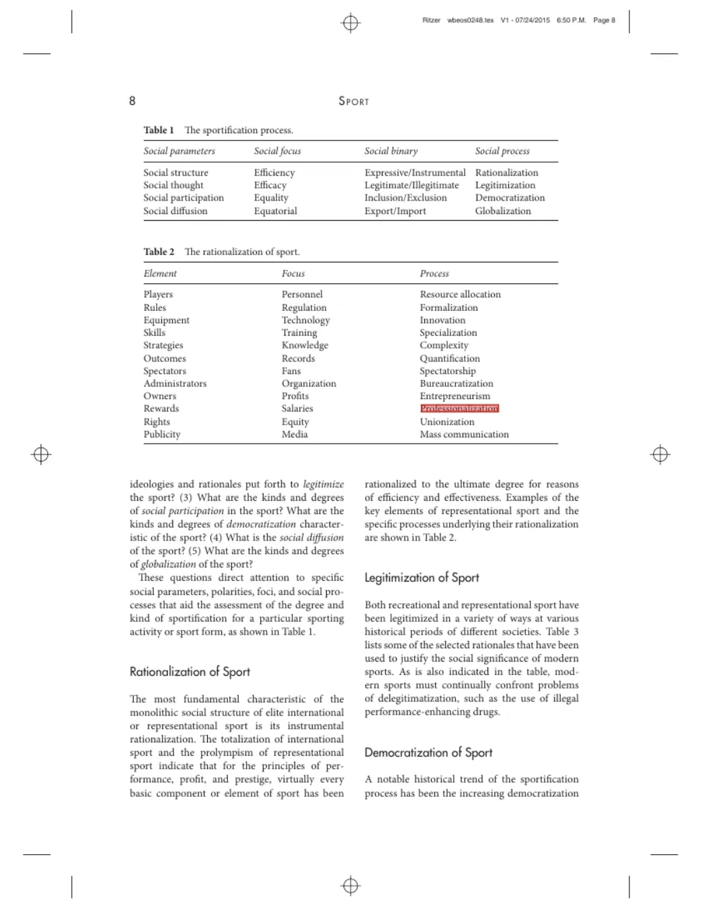
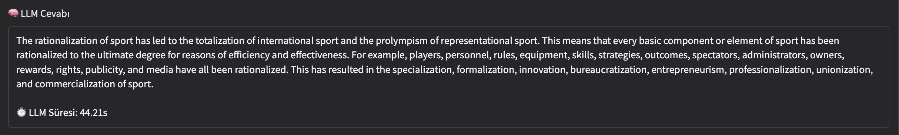
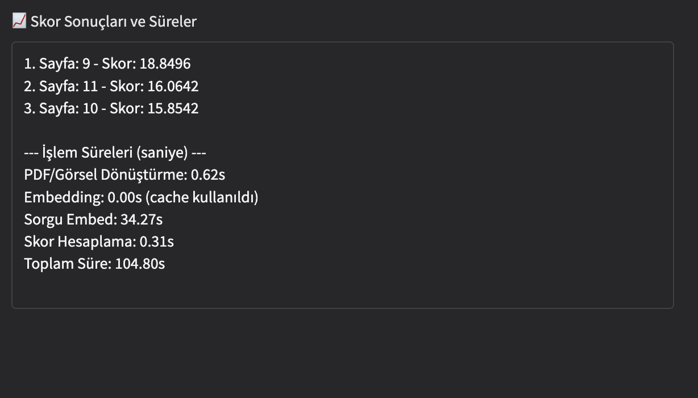
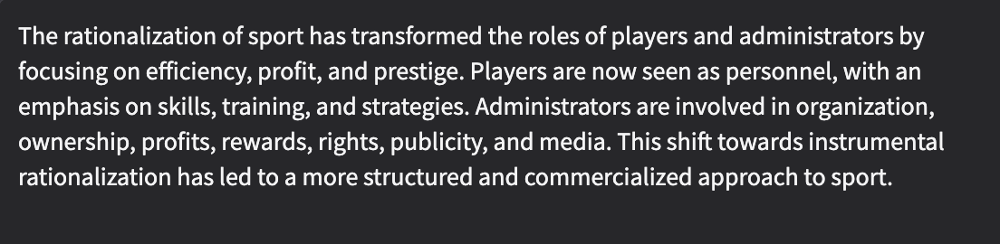

# ColPali: Görsel & PDF Tabanlı Belge Anlama Sistemi

## Proje Özeti

ColPali, kullanıcıların PDF veya görsel dosyalar yükleyerek bu belgelerden **doğal dilde bilgi sorgulaması** yapmasına olanak tanıyan bir belge anlama sistemidir. OCR ile metne dönüştürülen belgeler embedding ile anlamsal vektörlere dönüştürülür ve LLM destekli yanıtlar üretilir.

## Amaç

* Belgelerin içeriğinden anlamlı bilgi çıkarmak
* Kullanıcı sorgularına **LLM tabanlı, doğru ve kısa yanıtlar** üretmek
* **RAG (Retrieval-Augmented Generation)** ile kontekste dayalı sorgu yanıtlamak
* **Cevap highlight’lama**, **sayfa filtresi** gibi özellikleri desteklemek

---

## Kullanılan Teknolojiler

| Katman       | Teknoloji                             | Amaç                                        |
| ------------ | ------------------------------------- | ------------------------------------------- |
| Görsel Okuma | `pytesseract`, `pdf2image`, `PIL`     | OCR ve görsel dönüşüm                       |
| Vektörleme   | `ColPali Engine (ColQwen2)`           | Sayfa içeriğini embedding olarak dönüştürme |
| LLM          | `Mistral-7B-Instruct`, `transformers` | Doğal dil yanıt üretimi                     |
| LLM + RAG    | `LangChain`, `HuggingFacePipeline`    | Zincir tabanlı sorgu + cevap                |
| Arayüz       | `Gradio Blocks`                       | Etkileşimli uygulama                        |

---

## Sistem Mimarisi

1. Kullanıcı PDF veya görsel yükler
2. `pytesseract` ile OCR, `ColQwen2` ile embedding çıkarılır
3. Langchain ile benzer sayfalar skora göre sıralanır
4. `Mistral` LLM ile RAG mimarisi içinde cevap üretilir
5. ️ Cevabın alındığı görsel bölge highlight edilir

---

## 🔍 ColPali Nasıl Çalışır?

### 1. Girdi Yükleme

Kullanıcı sistem arayüzü üzerinden PDF veya resim dosyasını yükler.

### 2. OCR (Optical Character Recognition)

Dosya sayfaları görüntülere çevrilir ve `pytesseract` kullanılarak görsellerdeki metinler tanınır. Bu adımda her kelimenin pozisyon bilgisi (bounding box) da alınır, böylece görselde highlight yapılabilir.

### 3. Embedding Hesaplama

Her sayfanın OCR metni `ColPali Engine` ile **anlamsal vektörlere** dönüştürülür. Bu embedding’ler cache’e alınır, böylece aynı dosya tekrar yüklenirse süre kısalır.

### 4. Sorgu Girişi ve Sorgu Embed’i

Kullanıcının girdiyi doğal dildeki soru, encoder ile vektörleştirilir. Bu embedding, sayfa vektörleriyle karşılaştırılır.

```python
images = convert_from_path(file.name, dpi=100)
dataloader = DataLoader(
    dataset=images,
    batch_size=1,
    collate_fn=lambda x: processor.process_images(x)
)
for batch in dataloader:
    batch = {k: v.to(model.device) for k, v in batch.items()}
    embeds = model(**batch)
```

### 5. Skor Hesaplama ve En İyi Sayfaların Seçimi

* Sorguya en yakın sayfalar `cosine similarity` ile bulunur. `Plaid index` ile en iyi 3 sayfa seçilir ve bu sayfalardaki metinler LLM'e verilir.

#### Cosine similarity
ColPali’de Kullanımı
* Kullanıcının sorusu embed edilir.
* Tüm sayfa embedding’leri ile karşılaştırılır.
* En yüksek cosine skoruna sahip sayfalar, en anlamlı sayfalardır.

#### Plaid index
ColPali’de Kullanımı:
* Tüm sayfa embedding’leri Plaid Index’e yüklenir
* Sorgu vektörüyle en benzer top-k sayfa hızlıca bulunur
* Bu sayfalar LLM’e verilecek içerik olarak seçilir



### 6. LLM ile RAG (Retrieval-Augmented Generation)

Seçilen sayfa metinleri, prompt yapısı ile birlikte **LLM** modeline verilir. Model, bu kontekste dayalı öz ve anlamlı bir cevap üretir.
* LangChain zinciri şöyle kurulu: PromptTemplate → HF Pipeline → Parser.
* Prompt: “Context: …\n\nQuestion: …\n\nAnswer:” formatında.
* Mistral-7B modeli bu kontekste dayalı, kısa ve öz bir cevap üretiyor.
* Yanıt sonrası CleanHFParser ile prompt kısmı temizleniyor.

```python
prompt_template = PromptTemplate.from_template(template)
qa_chain = prompt_template | llm_langchain | CleanHFParser()
```

### 7. Highlight Etme

Modelin cevabından anahtar ifade çıkarılır ve OCR kutularıyla karşılaştırılır. En benzer kutu belirlenir ve ilgili bölge görselde renklendirilir.
* Cevaptan gelen kısa metin OCR bloklarıyla SequenceMatcher kullanılarak eşleştiriliyor.
* En iyi eşleşen kutu, ImageDraw ile sayfa üzerine şeffaf kırmızı bir dikdörtgenle işaretleniyor.

```python
def draw_highlight(image, box, color=(255, 0, 0, 80), width=2):
    overlay = Image.new("RGBA", image.size, (0, 0, 0, 0))
    draw = ImageDraw.Draw(overlay)

    x0 = box["left"]
    y0 = box["top"]
    x1 = x0 + box["width"]
    y1 = y0 + box["height"]

    draw.rectangle([x0, y0, x1, y1], fill=color, outline=(255, 0, 0, 200), width=width)

    highlighted = Image.alpha_composite(image.convert("RGBA"), overlay)
    return highlighted.convert("RGB")
```



### 8. Sonuçların Görselleştirilmesi

* LLM yanıtı
* Cevabın geldiği sayfanın highlight'ı
* Sayfa skorları ve işlem süreleri
  kullanıcıya sunulur.



---

## Ana Özellikler

*  PDF/görsel içeriğinden bilgi çekme
*  OCR + embedding + RAG destekli LLM cevaplama
*  Sayfa aralığı filtresiyle sorgu kısıtlama
*  Cevabın geldiği görsel bölgeyi ışaretleme
*  Kullanıcı dostu Gradio arayüz

---

## Sunum İçin Şablon: Süreler

| Aşama                  | Süre (saniye) | Açıklama                |
| ---------------------- |---------------| ----------------------- |
| PDF Yükleme & OCR      | `0.62`        | pdf2image + pytesseract |
| Embedding Çıkarma      | `-`           | ColQwen2 modeli         |
| Sorgu Embed + Skorlama | `34.27`       | LangChain + Plaid       |
| LLM Yanıt              | `44.21`       | Mistral LLM çıktısı     |
| Toplam                 | `104.80`      | Tüm sistem suresi       |

---




## Proje Notları

* HF token ile Mistral 7B modeli çekilmektedir.
* Önbellek ile tekrar embedding hesaplama azaltılır
* Kodlar GPU üyumlu çalışacak şekilde düzenlenmiştir

---

## Projeyi Neden Seçtim?

* Gerçek dünya problemini çözüyor
* NLP + CV + RAG entegrasyonu sunuyor
* Kullanıcı deneyimine odaklı
* Teknik derinlik ve sunum kolaylığı sağlıyor

---

## LLM Karşılaştırması: Mistral-7B vs Phi-3-mini

| Özellik                | **Mistral-7B-Instruct**                     | **Phi-3-mini-4k-instruct**                    |
|------------------------|---------------------------------------------|----------------------------------------------|
| Model Boyutu           | ~7B parametre                               | ~3.8B parametre                              |
| Bellek Tüketimi (fp16) | Yüksek (GPU RAM > 12 GB önerilir)           | Düşük (8 GB GPU üzerinde rahat çalışır)      |
| Cevap Kalitesi         | Daha tutarlı, bağlama daha duyarlı          | Hızlı yanıt veriyor, ancak bağlam çözümlemesi sınırlı |
| Eğitim Verisi          | Geniş & Instruct-tuned                      | Lightweight, metin odaklı                    |
| Kontekst Uzunluğu      | 32k token’a kadar destekler                 | 4k token’a kadar                             |
| RAG Uyumluluğu         | Çok uygun – kontekste göre güçlü genelleme  | Sınırlı bağlam algısı, kısa kontekstlerde iyi |
| Hız                    | Orta (özellikle CPU’da)                   | Yüksek (hafifliği sayesinde hızlı başlar)    |
| Kullanım Durumu Önerisi| Karmaşık sorgular, detaylı analizler        | Basit soru-cevap, düşük donanımlı cihazlar   |

### Mistral



### Neden Mistral-7B’i Ana Model Olarak Seçtim?

- **Yanıt kalitesi** yüksek ve uzun metinlerde **bağlamı iyi tutuyor**
- RAG yapısına uygun şekilde **top-3 sayfa üzerinden analiz** yapabiliyor
- ColPali mimarisi gibi çok bileşenli sistemlerde **kararlılık ve esneklik sağlıyor**

### Phi-3-mini Ne Zaman Kullanılır?

- Hafifliği sayesinde **mobil/edge cihazlar** için ideal
- **Hızlı prototipleme** veya düşük donanımlı sistemlerde temel bilgi çekimi için uygun
- Kısa kontekstli, yönlendirmesi açık sorularda etkili sonuçlar üretir

---

## Nasıl Geliştirilebilir?

### Teknik Geliştirme

* Embed cache'leri daha etkili saklama

### UX Odaklı Geliştirme

* Highlight alanına tıklanılabilirlik (interactive canvas)
* Cevaplanan soruyu PDF içinde gezebilme (PDF viewer)

---

## Karşılaşılan Zorluklar ve Çözüm Yolları

### 1.  LLM Çıktısında Prompt’un Tekrar Dönmesi
* Sorun: LLM yanıtı içinde prompt metni (örn. “You are a helpful assistant…”) da tekrar ediyordu.
* Neden: transformers.pipeline() varsayılan olarak tüm text’i döndürüyor.
* Çözüm:
* return_full_text=False parametresi eklendi ve CleanHFParser sınıfı ile "Answer:" sonrası kısmı parse edecek yapı kuruldu.

### 2. LangChain Zincirine Custom Output Parser Eklerken Hata
* Sorun: TypeError: Expected a Runnable... hatası alındı.
* Neden: CleanHFParser sınıfı Runnable olarak yazılmamıştı.
* Çözüm:
* CleanHFParser(Runnable) sınıfı invoke fonksiyonuyla uyumlu hale getirildi.
* StrOutputParser() ile fallback olarak alternatif parser kullanılabilir şekilde yapılandı.

### 3. LLM Yanıt Süresinin Uzaması
* Sorun: Yanıt süreleri 50–170 saniye arasında değişiyordu.
* Neden: Colab GPU’da Mistral-7B çalışırken bazen overload yaşıyor, özellikle embedding + RAG eşzamanlı çalışınca.
* Çözüm:
* Embedding önceden cache’lendi (embedding_cache.pkl)
* LLM’in max_new_tokens=512 sınırı getirildi.
* Daha hafif alternatif olarak Phi-3-mini test edildi (daha hızlı ama bağlam zayıf).

### 4. Yanıtın Highlight Edilememesi
* Sorun: Bazı cevaplar OCR bloklarında birebir eşleşmediği için highlight başarısız oluyordu.
* Çözüm:
* difflib.SequenceMatcher ile benzerlik skoru % eşik değerine göre optimize edildi.
* Gerekirse fallback olarak ilk sayfada gösterim yapılması eklendi.
* 
---

## Hazırlayan

* Burak AKÇAY
* [burakakcay44@gmail.com](mailto:burakakcay44@gmail.com)
* [LinkedIn](https://www.linkedin.com/in/burakakcay44/)

